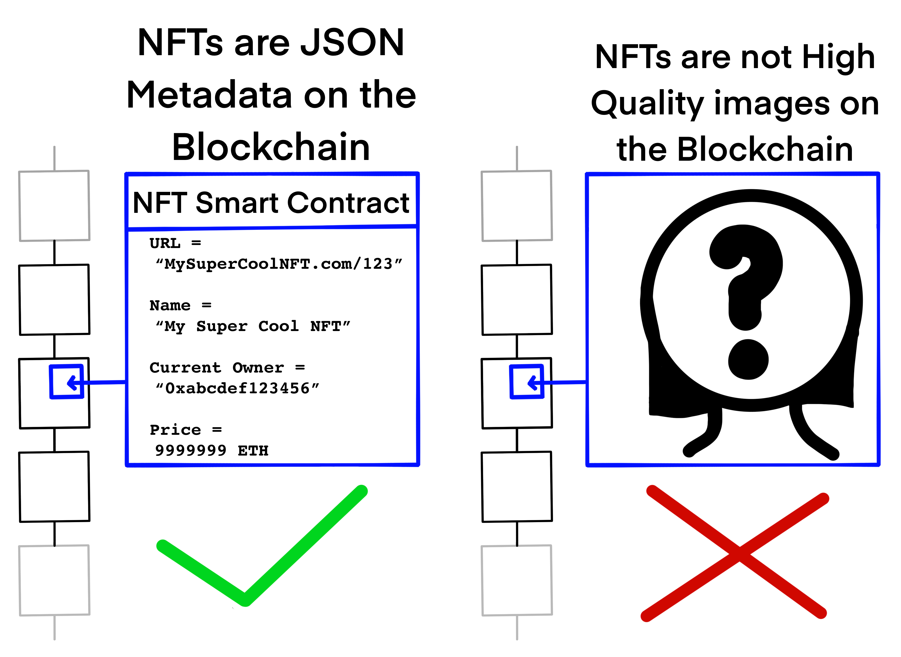

# Outline

# What is an NFT?

There is a lot of confusion on what an NFT is and this article aims to
educate. The goal is to truly learn what NFTs without the influence of bias or
the use of confusing analogies.

Nonfungible Token, or NFT, is a unique unit of data that is not interchangable
with any other unit of data. It is in constrast to fungible items such as a
dollar bill or bitcoin where each unit is equivalent to one another and can be
easily swapped with one another. Typically, we see NFTs implemented on a
blockchain such as Ethereum. The benefit of storing them on a decentralized
blockchain is that they will be distributed to many computers and also be
available for anyone to see at all times. Ethereum's Smart Contract platform
is one of the most popular methods of implementing NFTs because of it is a
popular chain with strong developer tooling. Assuming the Smart Contract is
correctly implemented, once an NFT is established on the blockchain, a sense
of scarcity, genuineness, and permanence emerges leading to NFT markets where
people buy, sell, and trade NFTs as commodities.

The methods of interacting with NFTs on a blockchain are simple. **Owning** an NFT
is simply assigning your public Address as the owner of a unit of data within
a Smart Contract. **Transfering** an NFT is re-assigning the owner to a new
Address.

## What an NFT is not

- A literal picture on the block chain
  - Exceptions
    - cryptopunks

## What an NFT is

Not all NFTs are created equally. Some are higher quality than others, and many NFT Contracts were created with permanent vulnerabilities and fundemental misunderstandings on how the internet works. There are popular projects that continue to trade high volumes that are low quality and this can only be attributed to a lack of knowledge by participants of the underlying code.

An NFT is **a Smart Contract that stores data on a Blockchain**. The **Metadata** must contain NFT **ID**s, **Ownership information**, and **NFT Metadata**.

Essentially, NFTs are unique IDs that have owners, as well as small bits of additional metadata on each ID that describe each particular NFT. Metadata is particularly important to understand as this is what differentiates **Good** NFTs from **Bad** NFTs

### What is NFT Metadata?

These can take many forms and some offer much more security, longevity, and accuracy than others.

- IPFS Hashes - A string of characters indicating where users can go off-chain to find the original NFT image or additional information
- IPFS Gateway URLs - Similar to an IPFS Hash, this is an internet facing link to a public IPFS Gateway. IPFS Gateways are websites that allow users to view IPFS data. There are no guarantees 
- Proprietary API URLs
- Pixel maps

# What makes an NFT valuable

- A reputable Smart Contract
  - One that publishes their ABI is even better
  - Smart Contract activity and popularity
- A correct metadata (more on this later)
- Age

# What is NFT Metadata and are some better than others?

## Egregious offender: Lazy Lions NFT

### Checking NFT Metadata for yourself

- Running Geth

  - I choose to run it in docker like this

- Getting ABI

  - Why do we need this?
    - Smart Contracts are compiled bytecode = hard (impossible) to know what they do without an ABI
    - Authors might not want you to interact with their contract

- Querying with Web3
  - geth attach
