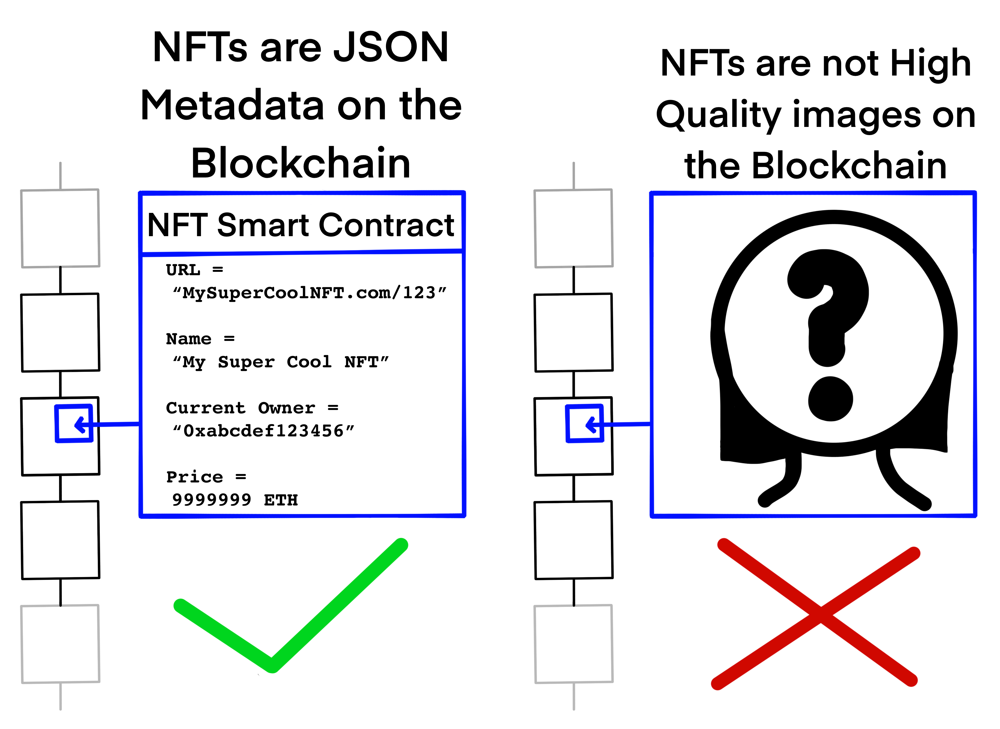
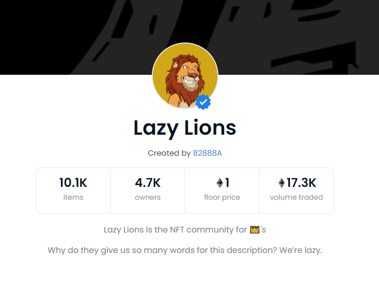
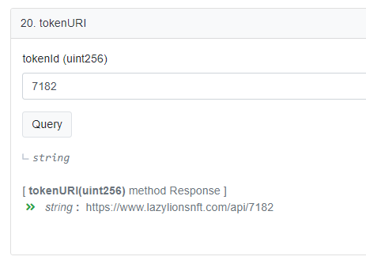
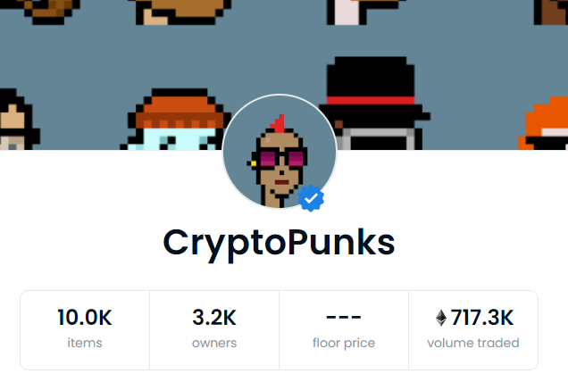

There is a lot of confusion on what an NFT is and this article aims to educate.
The goal is to truly learn what NFTs are faithfully and without the influence of
bias or confusing analogies.

Nonfungible Token, or NFT, is a unique unit of data that is not interchangable
with any other unit of data. It is in constrast to fungible items such as a
dollar bill or Bitcoin where each unit is equivalent to one another and can be
easily swapped with one another without losing value. Typically, we see NFTs
implemented on a Blockchain such as Ethereum. The benefit of storing them on a
decentralized Blockchain is that they will be distributed to many computers and
also be available for anyone to see at all times. Ethereum's Smart Contract
platform is one of the most popular methods of implementing NFTs because it
is a strong chain with strong developer tooling. Assuming the Smart Contract is
correctly implemented, once an NFT is established on the Blockchain, a sense of
scarcity, genuineness, and permanence emerges leading to NFT markets where
people buy, sell, and trade NFTs as assets.

The methods of interacting with NFTs on a Blockchain are simple. **Owning** an
NFT is simply assigning your public Address as the owner of a unit of data
within a Smart Contract. **Transfering** an NFT is re-assigning the owner to a
new Address. **Selling** would consist of a payment to an address, followed by a
**Transfer**.

## What an NFT is not

There is a common misconception that NFTs are _literal_ images distrbuted on the
Ethereum Blockchain. This is absolutely not the case. The vast majority of NFTs
minted are high quality PNG or JPEG file formatted pictures that exist off of
the Blockchain (this is commonly referenced as being **off-chain**). The
community has chosen the [IPFS system](https://en.wikipedia.org/wiki/InterPlanetary_File_System)
to help in the integrity of NFTs. For all intents and purposes, this is a good
decision. The IPFS (Interplanetary File System), is a distrbuted database of
files similar to that of Bit Torrent. Files are uploaded permanently and are
assigned an **IPFS Hash**: A unique ID for each file. IPFS operators help
provide integrity to files by backing up portions of the entire IPFS. Together,
a strong and permanent network of file systems creates a database of files
that cannot be easily deleted or changed.

However, there does exist projects that encode image data directly onto the
Blockchain usually in the format of low-size pixel map or pixel art styles. The
only way to determine if your NFT is a quality one is to look at your NFT's
Smart Contract for how it is implemented.

## What an NFT is

Not all NFTs are created equally. Some are higher quality than others, and many
NFT Contracts were created with permanent vulnerabilities and fundemental
misunderstandings on how the internet works. There are popular projects that
continue to trade high volumes that are low quality and this can only be
attributed to a lack of knowledge by participants of the underlying code.

An NFT is **a Smart Contract that stores data on a Blockchain**. The
**Metadata** must contain NFT **ID**s, **Ownership information**, and **NFT Metadata**.

Essentially, NFTs are unique IDs that have owners, as well as small bits of
additional Metadata assigned to each ID that describes it. Metadata is
particularly important to understand as this is what differentiates **Good**
NFTs from **Bad** NFTs



### What is NFT Metadata?

These can take many forms and some offer much more security, longevity, and accuracy than others.

| Type                 | Characteristics                                                                                                                                                                                                                                                                                                    |
| -------------------- | ------------------------------------------------------------------------------------------------------------------------------------------------------------------------------------------------------------------------------------------------------------------------------------------------------------------ |
| IPFS Hashes          | A string of characters indicating where users can go off-chain to find the original NFT image or additional information                                                                                                                                                                                            |
| IPFS Gateway URLs    | Similar to an IPFS Hash, this is an internet facing link to a public IPFS Gateway. IPFS Gateways are websites that allow users to view IPFS data. There are no guarantees that this domain will be around forever, or will remain in honourable hands.                                                             |
| Proprietary API URLs | Websites that the NFT project owners host to provide additional information about their NFTs or for the original images.                                                                                                                                                                                           |
| Image encoded        | less common, but potentially the most "accurate" implementation as image data is encoded directly into the Smart Contract itself so that all data is on-chain. These typically take the form of pixelated images as there are limits to the amount of data a Smart Contract can reasonably write to the blockchain |

In terms of which NFT Metadata is "better" can be a matter of the goal of the
NFT project. If the NFT project is interested in minting high quality images,
then an IPFS Hash is probably the best way to go. If a project is interested in
the the purity and security of the product that is being sold, encoding the
image directly onto the blockchain is the best way (However this has limitations
to how big the images can be). Any NFT minted that has its Metadata tied to the
developer's website or that of any other personal domain name, including IPFS
gateways, can be considered unbacked by decentralized infrastructure (whether
IPFS or Blockchains), and thus should not be valued at all. There is no
guarantee that the website containing your NFT information with always be live
serving your NFT Metadata. And of course, a good name and description along with
the afformationed data is desirable.

# What makes an NFT valuable?

It can be hard to understand what makes NFTs seemingly sell for such high
prices. I will offer a few theories on what can make an NFT valuable to me.

### A Reputable Smart Contract

A Smart Contract that is in someways unique, clever, the first, a community
favorite, or other reasons can bring value to the NFT's it mints.

### A Smart Contract that publishes their ABI and Source Code

This is a necessity. Smart Contracts that do not publish their Application
Binary Interface prevent outside individuals from interacting with them.
Essentially, those with non-public ABIs should have their legitimacy scrutinized
and should not be interacted with.

### Age

Older Smart Contracts with a larger transaction history can help being
legitimacy to their NFTs.

### Image Encoded NFTs

Smart Contracts that encoded their NFTs directly to the Blockchain are more pure
than those that do not.

# Egregious offender: Lazy Lions NFT

To illustrate the points made here, we can look at a particularly bad NFT:
[Lazy Lions.](https://www.lazylionsnft.com/)

At the time of writing this, Lazy Lions has 17.3k of Ethereum traded by volume.
That is almost $8,000,000! Lazy Lions is a collection of NFTs representing
profile pictures of Lions. They claim that each NFT is unique and that each was
created programmatically from a selection of different traits and colors. The
idea here is that "rare" NFTs will be organically created due to the random
selection of traits. For example, if during the creation of the collection, only
one NFT obtained the "Blue" trait, then that member would be exceedingly rare
(and thus, worth more money). However, their algorithm for programatically
generating NFTs is closed-source so it is impossible to know just how organic
the Lions really are. We can view this NFT Smart Contract's Metadata on
[Etherscan](https://etherscan.io/address/0x8943c7bac1914c9a7aba750bf2b6b09fd21037e0).

We can view this entire collection on [OpenSea](https://opensea.io/collection/lazy-lions).



OpenSea lets anyone viewing NFTs the ability to see the NFT Contract Address and
NFT ID. We can use these together to view the **NFT Metadata**. For example,
Lazy Lion #7182 (I selected this at random) has a Contract address of
**0x8943c7bac1914c9a7aba750bf2b6b09fd21037e0** and ID of **7182**

We can use [Etherscan's Read Contract
feature](https://etherscan.io/address/0x8943c7bac1914c9a7aba750bf2b6b09fd21037e0#readContract)
to conveniently query the Contract for **NFT Metadata**. Executing the
`tokenURI` method with an argument of `7182` will get us the Token's URI, a
off-chain location that has additional information.



The method returned a string and we now have an off-chain place to visit: [tokenURI](https://www.lazylionsnft.com/api/7182)

This is a NFT with it's Metadata in the form of a **Proprietary API**. Visiting this link returns us JSON:

```json
{
  "name": "#7182",
  "tokenId": 7182,
  "image": "https://gateway.pinata.cloud/ipfs/QmT7n9pymJ8z6rQH9hAD48LBMuxb5PhQAZCmFXLjHpk6bV",
  "external_url": "https://www.lazylionsnft.com/",
  "attributes": [
    { "trait_type": "Background", "value": "Iron" },
    { "trait_type": "Body", "value": "Standard" },
    { "trait_type": "Bodygear", "value": "Police Uniform" },
    { "trait_type": "Earring", "value": "Nothing" },
    { "trait_type": "Eyes", "value": "Stoner" },
    { "trait_type": "Headgear", "value": "Halo" },
    { "trait_type": "Mane", "value": "Top Knot - Fire" },
    { "trait_type": "Mouth", "value": "Big Smile" }
  ]
}
```

_We can see the `image` is the form of an **IPFS Gateway**. This, however, does not mean much for the quality of this NFT as this IPFS information is already behind a proprietary API._

Attaching NFT Metadata as an off-chain link such as `lazylionsnft.com/api/7182`
gives the owners of `lazylionsnft.com` the ability to change NFT Metadata
whenever they desire! NFTs like this have essentially none of the benfits of
being on the Ethereum Blockchain and are nothing more than links to someone
else's website. There is no sense of permanence, no data integrity, and no
guarantee that Lazy Lions NFT won't just be a collection of defunct links years
from now.

# Image Encoded NFT: CryptoPunks



A lot of the success of CryptoPunks can be attributed to the fact that it is an
**Image Encoded** NFT. This means that every NFT is solely on the Blockchain: No
IPFS, no off-chain API, no chance of compromise or change of Metadata.

Let's look at the data that is on-chain regarding a CryptoPunk NFT.

- Smart Contract for CryptoPunk data: [https://etherscan.io/address/0x16f5a35647d6f03d5d3da7b35409d65ba03af3b2](https://etherscan.io/address/0x16f5a35647d6f03d5d3da7b35409d65ba03af3b2)

Some of the methods this Contract offers are:

- `punkAttributes`
- `punkImage`
- `punkImageSvg`

--> `punkAttributes(6027)`

```
Male 3
Mole
Shaved Head
Classic Shades
```

--> `punkImage`

```
0x0ff000000ff000000ff000000ff000000ff000000ff000000ff0000000000000000000000000000000000000000000000000
0000000000000000000000000000000000000000000000000000000000000000000000000000000000000ff5e4c37ff5e4c37f
f5e4c37ff5e4c37ff5e4c37ff5e4c37ff5e4c37ff000000ff00000000000000000000000000000000000000000000000000000
00000000000000000000000000000000000000000000000000000000000000000ff5e4c37ff5e4c37ff645849ff5e4c37ff5e4
c37ff5e4c37ff5e4c37ff5e4c37ff5e4c37ff000000ff00000000000000000000000...
```

--> `punkImageSvg`

```xml
<svg xmlns="http://www.w3.org/2000/svg" version="1.2" viewBox="0 0 24 24">
    <rect x="8" y="5" width="1" height="1" shape-rendering="crispEdges" fill="#000000ff" />
    <rect x="9" y="5" width="1" height="1" shape-rendering="crispEdges" fill="#000000ff" />
    <rect x="10" y="5" width="1" height="1" shape-rendering="crispEdges" fill="#000000ff" />
    <rect x="11" y="5" width="1" height="1" shape-rendering="crispEdges" fill="#000000ff" />
    <rect x="12" y="5" width="1" height="1" shape-rendering="crispEdges" fill="#000000ff" />
    <rect x="13" y="5" width="1" height="1" shape-rendering="crispEdges" fill="#000000ff" />
    <rect x="14" y="5" width="1" height="1" shape-rendering="crispEdges" fill="#000000ff" />
    <rect x="7" y="6" width="1" height="1" shape-rendering="crispEdges" fill="#000000ff" />
    <rect x="8" y="6" width="1" height="1" shape-rendering="crispEdges" fill="#5e4c37ff" />
    <rect x="9" y="6" width="1" height="1" shape-rendering="crispEdges" fill="#5e4c37ff" />
    <rect x="10" y="6" width="1" height="1" shape-rendering="crispEdges" fill="#5e4c37ff" />
    <rect x="11" y="6" width="1" height="1" shape-rendering="crispEdges" fill="#5e4c37ff" />
    <rect x="12" y="6" width="1" height="1" shape-rendering="crispEdges" fill="#5e4c37ff" />
    <rect x="13" y="6" width="1" height="1" shape-rendering="crispEdges" fill="#5e4c37ff" />
    <rect x="14" y="6" width="1" height="1" shape-rendering="crispEdges" fill="#5e4c37ff" />
    <rect x="15" y="6" width="1" height="1" shape-rendering="crispEdges" fill="#000000ff" />
...
```

As we can this is a map of X, Y coordinates in an SVG format. We can open this as an SVG file with any SVG viewer:


Just having the NFT ID, we can see NFT attributes and render the image. All of
this information has come from the Ethereum Blockchain and no off-chain data
sources.

NFTs like these are some of the most expensive to mint. However, they are the
most pure in terms of Blockchain philosophies, offer the best security, and
have guaranteed data permanence.

### Checking NFT Metadata for yourself

If you have the Smart Contract Address, ABI, and an Ethereum node, you can check
NFT data yourself. This is the most reliable way to know what you are getting
for your purchase.

```js
const Web3 = require('web3');
const net = require('net');

// Contract ABI
const abi = require('./abi.json');

// Use an Infura Ethereum node. Better yet, use your own localhost.
const web3 = new Web3(
  new Web3.providers.HttpProvider('https://mainnet.infura.io/v3/<INFURA_API_KEY>'),
);

// Contract address
const contract = new web3.eth.Contract(abi, '0x8943c7bac1914c9a7aba750bf2b6b09fd21037e0');

// Query the tokenURI method of the Contract
contract.methods
  .tokenURI(7182)
  .call()
  .then((res) => {
    console.log(res);
  });
```

# Conclusion

## NFT exchanges like OpenSea and Foundation present their NFTs like they are all the same -- And they are not.
